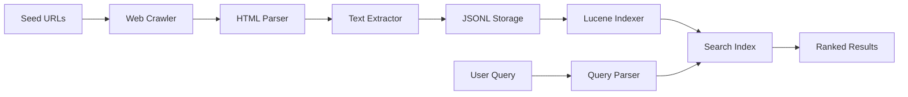

# 🔍 Search Engine Using Apache Lucene

<div align="center">


**A powerful search engine implementation demonstrating core information retrieval concepts**

[Features](#-features) • [Demo](#-demo) • [Installation](#-installation) • [Usage](#-usage) • [Documentation](#-documentation)

</div>

---

## 📌 Project Description

This project implements a **basic search engine** that crawls web pages, extracts textual content, indexes it using **Apache Lucene**, and supports efficient keyword-based search. It demonstrates core information retrieval concepts including:

- 🕷️ Web Crawling
- 📄 HTML Parsing & Text Extraction
- 🗂️ Document Indexing
- 🔎 Ranked Search Retrieval

---

## ✨ Features

| Feature | Description |
|---------|-------------|
| 🌐 **Web Crawling** | Automated crawling using predefined seed URLs with BFS traversal |
| 📝 **HTML Parsing** | Efficient text extraction using Jsoup library |
| 💾 **Data Storage** | Crawled data stored in JSONL format for easy processing |
| 🗃️ **Lucene Indexing** | Fast and scalable indexing using Apache Lucene |
| 🔍 **Keyword Search** | Relevance-based search with ranking algorithm |
| 🎯 **Multi-field Search** | Search across URL, title, and content fields |
| ⚡ **Performance** | Optimized for speed and efficiency |

---

## 🛠️ Technologies Used

<table>
  <tr>
    <td align="center" width="96">
      
      <br>Java
    </td>
    <td align="center" width="96">
      
      <br>Lucene
    </td>
    <td align="center" width="96">
      
      <br>Jsoup
    </td>
  </tr>
</table>

### Core Dependencies
- **Java** - Programming language
- **Apache Lucene** - Indexing and search library
- **Jsoup** - HTML parsing library
- **File I/O** - Data persistence
- **Data Structures** - BFS, HashSet for efficient crawling

---

## 📁 Project Structure

```
Lucene/
├── 📂 src/
│   ├── 🕷️ Webcrawling.java          # Web crawler implementation
│   ├── 📄 ContentExtractor.java     # HTML parsing and text extraction
│   ├── 🗂️ LuceneIndexing.java       # Document indexing
│   └── 🔍 LuceneSearching.java      # Search functionality
│
├── 📚 lib/
│   ├── jsoup-*.jar                  # Jsoup library
│   ├── lucene-core-*.jar            # Lucene core
│   ├── lucene-analysis-common-*.jar # Text analysis
│   └── lucene-queryparser-*.jar     # Query parsing
│
├── 📊 paths/
│   └── extracted_pages.jsonl        # Crawled data storage
│
├── 🗃️ index/
│   └── (Lucene index files)         # Generated index
│
└── 📖 README.md                      # Project documentation
```

---

## 🚀 Installation

### Prerequisites
- Java Development Kit (JDK) 8 or higher
- Apache Lucene library
- Jsoup library

### Steps

1. **Clone the repository**
   ```bash
   git clone https://github.com/yourusername/lucene-search-engine.git
   cd lucene-search-engine
   ```

2. **Download dependencies**
   - Download [Apache Lucene](https://lucene.apache.org/core/downloads.html)
   - Download [Jsoup](https://jsoup.org/download)
   - Place JAR files in the `lib/` directory

3. **Create necessary directories**
   ```bash
   mkdir -p bin paths index
   ```

4. **Compile the project**
   ```bash
   javac -cp "lib/*" -d bin src/*.java
   ```

---

## 💻 Usage

### 1️⃣ Web Crawling
Crawl websites and extract content:
```bash
java -cp "bin;lib/*" src.Webcrawling
```
This will:
- Start from seed URLs
- Crawl pages using BFS
- Extract text content
- Save data to `paths/extracted_pages.jsonl`

### 2️⃣ Indexing
Build the search index:
```bash
java -cp "bin;lib/*" src.LuceneIndexing
```
This will:
- Read crawled data
- Create Lucene index
- Store index in `index/` directory

### 3️⃣ Searching
Perform keyword searches:
```bash
java -cp "bin;lib/*" src.LuceneSearching
```
Enter your search query and get ranked results!

---

## 📊 Demo

### Example Search Query

```
Enter search query: artificial intelligence

Results:
━━━━━━━━━━━━━━━━━━━━━━━━━━━━━━━━━━━━━━━━━━━━━━━
Rank 1 | Score: 0.95
Title: Introduction to AI
URL: https://example.com/ai-intro
Content: Artificial intelligence is transforming...
━━━━━━━━━━━━━━━━━━━━━━━━━━━━━━━━━━━━━━━━━━━━━━━
```

---

## 🏗️ Architecture



---

## ⚙️ Configuration

You can customize the crawler behavior by modifying:

```java
// In Webcrawling.java
private static final int MAX_DEPTH = 3;
private static final int MAX_PAGES = 100;
private static final String[] SEED_URLS = {
    "https://example.com",
    // Add more URLs
};
```

---

## ⚠️ Limitations

| Limitation | Description |
|------------|-------------|
| 🔢 Limited Depth | Crawling depth is restricted to prevent excessive crawling |
| 🔄 No Deduplication | Currently doesn't detect duplicate content |
| 📚 Basic Analysis | No stemming or synonym handling |
| 💻 CLI Only | Console-based interface without GUI |
| 🌐 Single-threaded | No parallel crawling support |

---

## 🚀 Future Enhancements

- [ ] **PageRank Implementation** - Implement PageRank-based ranking algorithm
- [ ] **Duplicate Detection** - Add content deduplication using hashing
- [ ] **Advanced Search** - Support for fuzzy search and phrase queries
- [ ] **Web Interface** - Build a web-based UI using Spring Boot
- [ ] **Parallel Crawling** - Multi-threaded crawler for better performance
- [ ] **Stemming & Lemmatization** - Improve text analysis
- [ ] **Auto-complete** - Search suggestions as you type
- [ ] **Cached Results** - Store frequently searched queries
- [ ] **Analytics Dashboard** - Search statistics and insights

---

## 🤝 Contributing

Contributions are welcome! Please follow these steps:

1. Fork the repository
2. Create a feature branch (`git checkout -b feature/AmazingFeature`)
3. Commit your changes (`git commit -m 'Add some AmazingFeature'`)
4. Push to the branch (`git push origin feature/AmazingFeature`)
5. Open a Pull Request

---

## 📝 Code Examples

### Web Crawling
```java
Queue<String> queue = new LinkedList<>();
Set<String> visited = new HashSet<>();
queue.add(seedURL);

while (!queue.isEmpty() && visited.size() < maxPages) {
    String url = queue.poll();
    if (!visited.contains(url)) {
        Document doc = Jsoup.connect(url).get();
        extractContent(doc);
        visited.add(url);
    }
}
```

### Indexing with Lucene
```java
IndexWriter writer = new IndexWriter(directory, config);
Document doc = new Document();
doc.add(new TextField("title", title, Field.Store.YES));
doc.add(new TextField("content", content, Field.Store.YES));
doc.add(new StringField("url", url, Field.Store.YES));
writer.addDocument(doc);
```

### Searching
```java
QueryParser parser = new QueryParser("content", analyzer);
Query query = parser.parse(searchQuery);
TopDocs results = searcher.search(query, 10);
```

---

## 📚 Documentation

For detailed documentation on:
- **Apache Lucene**: [lucene.apache.org](https://lucene.apache.org/)
- **Jsoup**: [jsoup.org](https://jsoup.org/)
- **Information Retrieval**: [Stanford IR Book](https://nlp.stanford.edu/IR-book/)

---

## 🎓 Learning Resources

- [Apache Lucene Tutorial](https://lucene.apache.org/core/documentation.html)
- [Web Crawling Basics](https://www.geeksforgeeks.org/web-crawler-in-java/)
- [Information Retrieval Concepts](https://www.coursera.org/learn/information-retrieval)

---

## 👤 Author

**Lakshmanan S**  
B.Tech – Artificial Intelligence and Data Science

[](https://github.com/yourusername)
[](https://linkedin.com/in/yourprofile)
[](mailto:your.email@example.com)

---

## 📜 License

This project is created for **educational purposes only**.

```
MIT License

Copyright (c) 2024 Lakshmanan S

Permission is hereby granted, free of charge, to any person obtaining a copy
of this software and associated documentation files (the "Software"), to deal
in the Software without restriction...
```

---

## 🙏 Acknowledgments

- Apache Lucene Team for the powerful search library
- Jsoup developers for HTML parsing capabilities
- Open source community for inspiration and resources

---

## 📊 Project Stats


---

<div align="center">

### ⭐ Star this repository if you found it helpful!

**Made with ❤️ by Lakshmanan S**

[Back to Top ⬆️](#-search-engine-using-apache-lucene)

</div>
